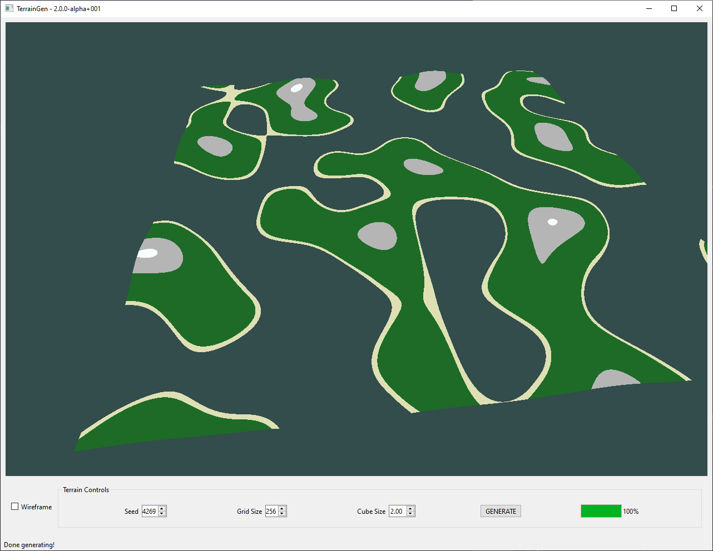

# terrain-gen
Procedural terrain generation using the Marching Cubes Algorith, OpenGL, and C++

UI built using [QT](https://www.qt.io/)

## About

This started more years ago than I'd like to admit as a final project for my graphics class. The original version 
[(v1.0)](https://github.com/zak-grumbles/terrain-gen/releases/tag/v1.0) was implemented using immediate mode OpenGL
and without shaders. This version has been re-implemented in the QT framework using shaders and more modern OpenGL.

The generation at this point is still single-threaded, so increasing your grid size will cause huge increases in
generation time. There are plans to make this _much_ faster in the future. 

## Screenshots

