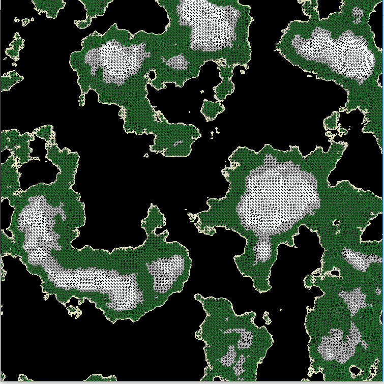
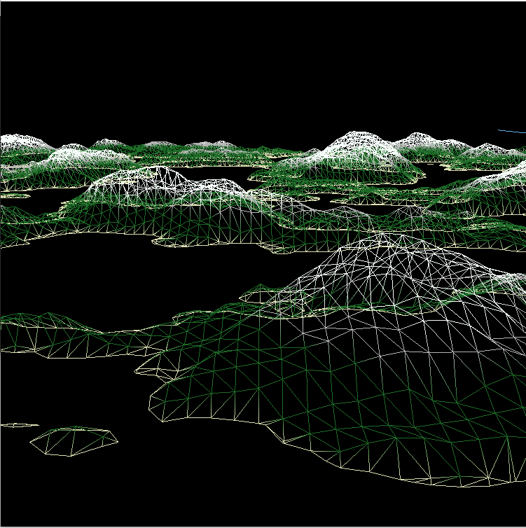

# terrain-gen
Procedural Terrain Generation using the Marching Cubes Algorithm, OpenGL, and C++

## About
Very simple procedural terrain generator

## Screenshots

## Releases
* [v1.0](https://github.com/zak-grumbles/terrain-gen/releases/tag/v1.0) - Barebones Terrain Generation

## Usage
When executed, the program will generate its default terrain. After it finishes this rendering, the terrain can be altered by changing any of the terrain variables in the control panel. Camera is controlled via WASD and is rotated by clicking and dragging.

## Libraries Used
* [libnoise](http://libnoise.sourceforge.net/) - Used to generate the noise function.
* [GML](http://glm.g-truc.net/0.9.7/index.html) - Used for math functions and camera implementation. Super awesome library.

### Thanks!
